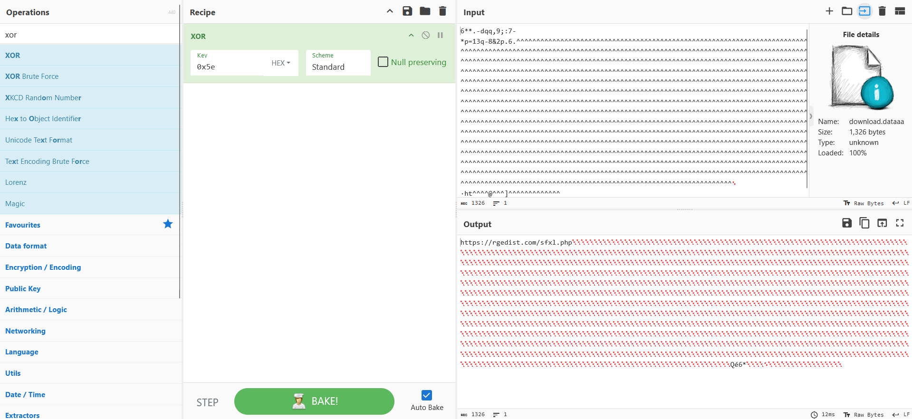

# POOLRAT - North Korean Backdoor Malware

**POOLRAT** is a backdoor malware used by the North Korean hacking group **Gleaming Pisces** (aka Citrine Sleet). It mainly targets **Linux and macOS** systems, giving attackers remote access to run commands, steal files, and control infected machines. POOLRAT has been seen in crypto-related attacks, often hidden inside fake trading apps to trick users into downloading it.

A similar macOS backdoor, named **SIMPLESEA**, was discovered by **Mandiant** during the **3CX supply chain attack**. SIMPLESEA allows attackers to execute commands, transfer files, and control infected devices over HTTP. Both POOLRAT and SIMPLESEA are linked to North Korean threat actors, including the **Lazarus Group**.

POOLRAT saves its configuration to a hardcoded config file at `/etc/apdl.cf`, which is **XOR-encrypted** with the key `0x5E`. Using **CyberChef** or a **Python script**, we can extract and decrypt the content of this config file.

## C2 Extraction from Linux

### **CyberChef**  
🔗 [CyberChef XOR Decoder](https://gchq.github.io/CyberChef/#recipe=XOR(%7B'option':'Hex','string':'0x5e'%7D,'Standard',false))



### **Python3**
You can use the Python script https://github.com/adhikara13/Malvares/blob/main/Linux/POOLRAT/config_extractor.py to decrypt POOLRAT’s configuration file.  
- By default, it will try to extract the config from **`/etc/apdl.cf`**.  
- You can also specify a different file using the **`--file`** flag.

## Reference:
1. https://unit42.paloaltonetworks.com/gleaming-pisces-applejeus-poolrat-and-pondrat/?web_view=true
2. https://www.3cx.ru/blog/mandiant-initial-results/

## Indicators of Compromise (IOC)

### POOLRAT Linux Sample:

🔗 SHA256:
```
f3b0da965a4050ab00fce727bb31e0f889a9c05d68d777a8068cfc15a71d3703
```
🔗 ANY.RUN Analysis:
[ANY.RUN TASK](https://app.any.run/tasks/45af6446-1689-4b45-9793-24043743bf12)

### POOLRAT C2 Server:

🔗 rgedist[.]com/sfxl.php